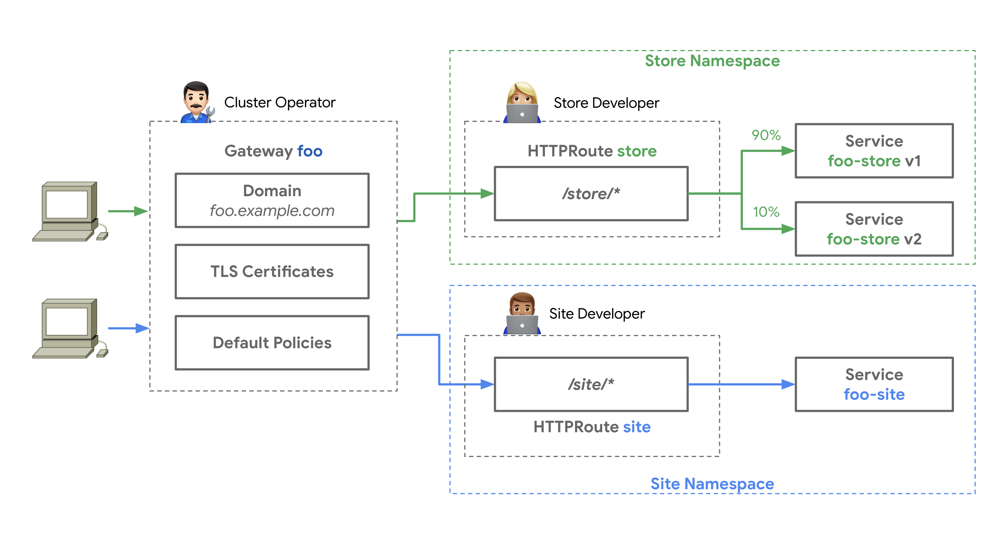

# Cloud Gateway Controller

The [Kubernetes Gateway API](https://gateway-api.sigs.k8s.io/) is an API for
describing network gateways and configure routing from gateways to Kubernetes
services.

This repository contain a Kubernetes controller that implements the
`GatewayClass` and `Gateway` resources of the Gateway API. In response to these
resources it creates a 'shadow' `Gateway` resource with a different
gateway-class and other resources to implement a network infrastructure. Hence,
this controller is a controller of controllers. This concept is described in
[Future of Cloud LB
Integration](https://events.istio.io/istiocon-2022/slides/f3-K8sGatewayAPIs.pdf). Particularly
this slide:

> 

The controller have several similarities with [GKE Edge to
Mesh](https://cloud.google.com/architecture/exposing-service-mesh-apps-through-gke-ingress)
and [GKE Gateway
controller](https://cloud.google.com/kubernetes-engine/docs/concepts/gateway-api#gateway_controller),
except this controller aims at being cloud agnostic.

## Objectives

- Provide a Kubernetes-native approach to define networking and go
  beyond typical 'ingress controller' -style implementations and
  provide deep integration with cloud infrastructure. This is in
  contrast to e.g. Terraform based deployments.

- Support multi-cluster setups. Single-cluster solutions is a pet
  pattern and e.g. typically upgrade 'in place'. Instead we prefer a
  'cattle' approach and require a solution that supports deploying our
  applications across a number of clusters - just like Kubernetes
  itself treats nodes as cattle and distribute workloads across nodes.

- Use the Kubernetes [Gateway API](https://gateway-api.sigs.k8s.io)
  as-is. This will allow usage of 'standard' tools like
  [Flagger](https://docs.flagger.app) for Canary deployments. The
  challenge is how to interpret this API in the context of
  multi-cluster.

## Why Not Use e.g. Crossplane or Helm?

An important objective of the cloud-gateway-controller is to maintain
a Gateway-API compatible interface towards users. This would not be
possible with techniques such as Crossplane and Helm.  Also, the
mapping from the gateway-API to e.g. a Crossplane composition is
non-trivial, i.e. it is difficult to do with purely templating.

## The Proof-of-Concept

This repository is a proof-of-concept that for convenience simulates
cloud resource and runs completely inside a KIND cluster.

...

## Building

```
make build container
make gateway-api-upstream-get
```

## Deploying

Setup test environment, which use Istio for the 'shadow'
gateway-class, Contour for the front load balancer and cert-manager to
issue TLS certificates:

```
make create-cluster deploy-gateway-api deploy-istio deploy-contour deploy-cert-manager
```

Deploy controller:

```
make kind-load-image deploy-controller
```

To watch the progress ans resources created, it can be convenient to watch for
resources with the following command:

```
watch kubectl get gateway,httproute,ingress,certificate,secret,po,gatewayclass -A
```

Deploy `GatewayClass` and a `ConfigMap` referenced by the `GatewayClass`. This
provides configuration for the controller:

```
kubectl apply -f test-data/gateway-class.yaml -f test-data/gateway-class-configmap.yaml
```

As an example, we will implement the following example usecase from
the Gateway API documentation:

> 
(source: https://gateway-api.sigs.k8s.io/)

In this example, three different personas are used. A cluster
operator/SRE that manages a Gateway in a `foo-infra` namespace and two
developer personas that manage two applications in `foo-store` and
`foo-site` namespaces.

The cluster operator also manages namespaces:

```
kubectl apply -f test-data/foo-namespaces.yaml
```

Developers will only have access to the `foo-site` and `foo-store`
namespaces. In the following we deploy applications using these
namespaces:

```
kubectl -n foo-site  apply -f test-data/test-app-site.yaml
kubectl -n foo-store apply -f test-data/test-app-store-v1.yaml -f test-data/test-app-store-v2.yaml
```

Deploy an example `Gateway` and `HTTPRoute` resources for the
applications with the following commands. The three commands are the
cluster-operator/SRE and developer roles respectively. You can review
the `Gateway` and `HTTPRoute` resources by leaving out the `kubectl
apply -f -` part:

```
helm template -n foo-infra foo-gateway gateway-api --values test-data/test-gateway-sre-role.yaml       --repo https://pixelperfekt-dk.github.io/helm-charts | kubectl apply -f -
helm template -n foo-site  foo-site    gateway-api --values test-data/test-gateway-site-dev-role.yaml  --repo https://pixelperfekt-dk.github.io/helm-charts | kubectl apply -f -
helm template -n foo-store foo-store   gateway-api --values test-data/test-gateway-store-dev-role.yaml --repo https://pixelperfekt-dk.github.io/helm-charts | kubectl apply -f -
```

In response to the `foo-gateway` `Gateway` created, expect to see a
shadow `Gateway` called `foo-gateway-istio`. Also, expect to see Istio
respond to the `foo-gateway-istio` `Gateway` by creating an
ingress-gateway deployment. The PODs created for the Istio
ingress-gateway names will start with `foo-gateway-istio-`.

Test access to test applications:

```
curl --resolve foo.example.com:80:127.0.0.1 http://foo.example.com/site
curl --resolve foo.example.com:80:127.0.0.1 http://foo.example.com/store
```

Expect to see a `Welcome-to-foo-site`, `Welcome-to-foo-store-v1` and `Welcome-to-foo-store-v2` being echoed.

Similarly, but using HTTPS through the cert-manager issued
certificate:

```
curl --cacert foo-example-com.crt --resolve foo.example.com:443:127.0.0.1 https://foo.example.com/site
curl --cacert foo-example-com.crt --resolve foo.example.com:443:127.0.0.1 https://foo.example.com/store
```
