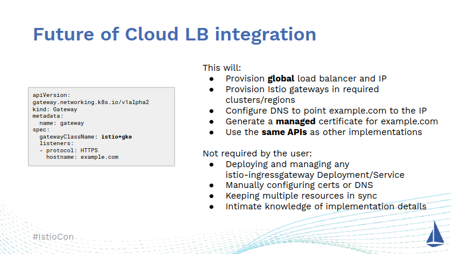

# Cloud Gateway Controller

The [Kubernetes Gateway API](https://gateway-api.sigs.k8s.io/) is an API for
describing network gateways and configure routing from gateways to Kubernetes
services.

This repository contain a Kubernetes controller that implements the
`GatewayClass` and `Gateway` resources of the Gateway API. In response to these
resources it creates a 'shadow' `Gateway` resource with a different
gateway-class and other resources to implement a network infrastructure. Hence,
this controller is a controller of controllers. This concept is described in
[Future of Cloud LB
Integration](https://events.istio.io/istiocon-2022/slides/f3-K8sGatewayAPIs.pdf). Particularly
this slide:

> 

The controller have several similarities with [GKE Gateway
controller](https://cloud.google.com/kubernetes-engine/docs/concepts/gateway-api#gateway_controller),
except this controller aims at being cloud agnostic.

## Building

```
make build container
make gateway-api-upstream-get
```

## Deploying

Setup test environment (using Istio for the 'shadow' gateway-class):

```
make create-cluster deploy-gateway-api deploy-istio 
```

Deploy controller:

```
make kind-load-image deploy-controller
```

Deploy `GatewayClass` and a `ConfigMap` referenced by the `GatewayClass`. This
configured the controller:

```
kubectl apply -f test-data/gateway-class.yaml
```

Deploy an example `Gateway`:
 
```
kubectl apply -f test-data/gateway.yaml
```

In response to the `foo-gateway` defined in `gateway.yaml`, expect to see a
shadow `Gateway` called `foo-gateway-istio`. Also, expect to see Istio respond
to the `foo-gateway-istio` `Gateway` by creating an ingress-gateway deployment.
